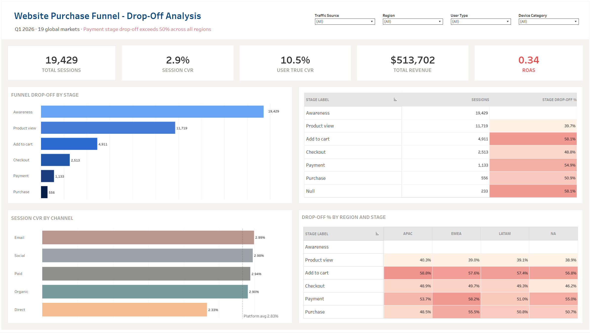

# Q1 2026 Marketing Funnel Analysis for Website Traffic

> For full analysis, visit my [Portfolio](https://dolomite-crabapple-a28.notion.site/Q1-2026-Marketing-Funnel-Analysis-for-Website-Traffic-325529d3f37d80d8bb9bc2602f02524f?source=copy_link)

## Key Analysis Areas & Project Objectives
Insights and recommendations are provided for **Marketing Team** on the following key areas:
1. **Funnel Performance Overview**
    - **Objectives:** Establish a baseline view of the full purchase funnel from awareness through purchase, identify which stages lose the most sessions, and quantify both session-based CVR (for campaign performance) and user-based true CVR (for actual conversion behavior) to determine where the biggest revenue recovery opportunity lies.
    - **Metrics:** Session Counts, Users Counts, Drop-Off Rate, Session-Based CVR, User-Based CVR
    - **Dimensions:** Funnel Stage
2. **Channel & Campaign Effectiveness**
    - **Objectives:** Evaluate which traffic sources and campaigns drive users deepest into the funnel, identify campaigns that generate high session volume but exit early, calculate ROAS to assess spend efficiency, and surface opportunities to reallocate budget from the underperform campaigns or channels.
    - **Metrics:** Sessions Counts, Session-Based CVR, Budget, Revenue, AOV, ROAS, Early Exit Rate (sessions that never passed awareness)
    - **Dimensions:** Funnel Stage, Traffic Source, Campaign Name, Campaign Channel
3. **Regional Performance**
    - **Objectives:** Compare funnel performance across markets to identify which regions convert well versus which inflate top-of-funnel metrics without contributing to revenue, with a focus on whether social-heavy markets in APAC justify their spend relative to conversion outcomes.
    - **Metrics:** Sessions Counts, Session-Based CVR, Drop-off Rate, Revenue, AOV, Revenue Per Session
    - **Dimensions:** Funnel Stage, Country, Region, Traffic Source
4. **Device & User Behavior**
    - **Objectives:** Understand whether drop-off patterns differ by device type, identify if mobile users abandon at a specific stage more than desktop users, and determine whether device-specific UX issues are contributing to checkout and payment failures. Compare funnel drop-off between new and returning users to determine whether acquisition or retention is the stronger conversion lever for N&N.
    - **Metrics:** Sessions Counts, Session-Based CVR, User-Based CVR, Revenue, AOV, Revenue Per Session
    - **Dimensions:** Funnel Stage, Device Category, User Type, Traffic Source

  
## Executive Summary
Based on the Q1 2026 website purchase funnel analysis across funnel performance, channel effectiveness, regional breakdown, and device behavior, the following key findings and recommendations were identified.

**Key Findings:**
- The Q1 2026 funnel faces a platform-wide payment crisis: all regions lose 50%+ of sessions at both Checkout → Payment (54.9%) and Payment → Purchase (50.9%), with drop-off rates clustering within 1%pt across all three devices. This is a systemic platform failure — not a device, region, or audience issue — and represents the single largest revenue recovery opportunity in the analysis.
- Every paid channel operates below 1.0 ROAS, meaning N&N is losing money on all paid marketing. Only `influencer_sea_q1` reaches breakeven (1.0 ROAS). Paid search carries the largest absolute loss ($735K budget, 0.20 ROAS), while `retargeting_global` ($175K, 0.14 ROAS) fails despite targeting the highest-intent audience. Free channels — organic and direct — outperform every paid channel on quality at zero marginal cost.
- N&N is more effective at converting strangers than retaining customers: returning users convert at 8.9% user-based CVR vs new users at 11.3% — a counterintuitive retention failure. The gap does not emerge at top-of-funnel but concentrates at Checkout → Payment (6.2%pt divergence), pointing to account state friction (expired saved cards, stale addresses, login barriers) rather than any product discovery or engagement issue.
- Device is not a conversion differentiator: drop-off rates are tightly clustered across desktop, mobile, and tablet at every funnel stage (within 1pp at both payment stages). The payment failure affects the entire customer base uniformly, confirming that a single platform-level fix — not device-specific UX work — is the correct scope of intervention.

**Key Recommendations:**
- - Fix the platform payment infrastructure first — reducing drop-off at Checkout → Payment and Payment → Purchase is the prerequisite that unlocks revenue recovery across every region, channel, and user type simultaneously. No other optimization will yield positive returns until this is resolved.
- Fix the returning customer checkout experience before resuming retargeting or loyalty spend — sending returning users back to the broken checkout experience compounds the loss. This fix must land before `retargeting_global` is rebuilt or email scaling is increased.
- Reallocate paid budget immediately: pause `retargeting_global` ($175K, 0.14 ROAS), cut paid search in underperforming regional allocations only, and scale email — currently underinvested at $30K with 3% CVR and a recoverable ROAS trajectory.
- Treat the US as a technical investigation priority — the home market converts at only 2.4% CVR while Canada converts at 4.0% on the same platform. The 17.4%pt gap in Payment → Purchase (US 59.4% vs Canada 42.0%) is not a demand problem; it is a product or technical issue requiring a dedicated checkout audit before any US paid investment increase.
- Scale LATAM incrementally — the highest-CVR region (3.2%), near-breakeven social spend, and the strongest channel-region combination in the dataset (LATAM direct at 6.1% CVR) make it the most underinvested high-potential region in the portfolio.

## Dashboard
The following dashboard allows stakeholders to explore the funnel by traffic source, region, user type, and device.

> View dashboard in Tableau Public: [Website Purchase Funnel - Drop-Off Analysis](https://public.tableau.com/views/WebsitePurchaseFunnel-Drop-OffAnalysis/Dashboard1?:language=en-US&:sid=&:redirect=auth&:display_count=n&:origin=viz_share_link)
